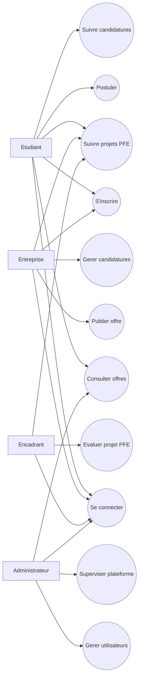
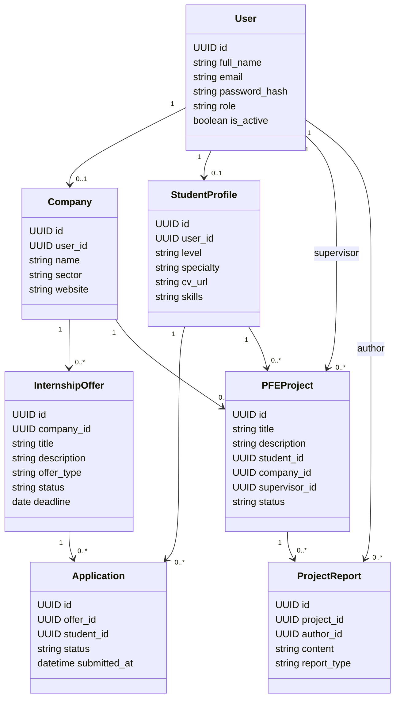

# Plateforme de Centralisation des Stages et PFE - Conception

## 1. Analyse du projet

La plateforme centralise les offres de stage, les candidatures, les projets de fin d'etudes et le suivi entre les etudiants, les entreprises, les encadrants et l'administration.

Objectifs principaux :

- Permettre aux etudiants de consulter les offres, postuler et suivre leurs candidatures.
- Permettre aux entreprises de publier des offres et traiter les candidatures recues.
- Permettre aux encadrants de suivre les projets PFE affectes.
- Permettre aux administrateurs de gerer les utilisateurs, les offres, les candidatures et les projets.

Perimetre Phase 1 : conception uniquement, sans developpement complet.

## 2. Architecture proposee

### Frontend

Technologies : React.js, Tailwind CSS, React Router, client HTTP type Axios ou Fetch.

Responsabilites :

- Interfaces utilisateur par role.
- Gestion de l'authentification cote client.
- Routage des pages publiques et privees.
- Consommation de l'API FastAPI.

### Backend

Technologies : FastAPI, SQLAlchemy, Pydantic, JWT, Alembic.

Responsabilites :

- API REST.
- Authentification et autorisation par roles.
- Validation des donnees.
- Acces PostgreSQL.
- Gestion des candidatures, offres, projets et utilisateurs.

### Database

Technologie : PostgreSQL.

Responsabilites :

- Stockage des utilisateurs.
- Stockage des offres de stage.
- Stockage des candidatures.
- Stockage des projets PFE.
- Stockage des affectations d'encadrement.

### Documentation

Contenu :

- Cahier de conception.
- Schema de base de donnees.
- Diagrammes Mermaid.
- Plan de developpement Phase 2.

## 3. Arborescence des fichiers

```text
plateforme-stages-pfe/
├── frontend/
│   ├── public/
│   └── src/
├── backend/
│   ├── app/
│   └── tests/
├── database/
│   ├── migrations/
│   └── seed/
└── docs/
    ├── conception.md
    └── diagrams/
```

Arborescence detaillee cible pour la Phase 2 :

```text
plateforme-stages-pfe/
├── frontend/
│   ├── public/
│   └── src/
│       ├── assets/
│       ├── components/
│       ├── layouts/
│       ├── pages/
│       │   ├── auth/
│       │   ├── dashboard/
│       │   ├── offers/
│       │   ├── applications/
│       │   ├── projects/
│       │   └── users/
│       ├── routes/
│       ├── services/
│       ├── store/
│       └── utils/
├── backend/
│   ├── app/
│   │   ├── api/
│   │   ├── core/
│   │   ├── models/
│   │   ├── schemas/
│   │   ├── services/
│   │   └── main.py
│   └── tests/
├── database/
│   ├── migrations/
│   └── seed/
└── docs/
    └── diagrams/
```

## 4. Pages principales

### Pages publiques

- Login : connexion par email et mot de passe.
- Register : inscription selon le type de compte autorise.

### Pages privees communes

- Dashboard : resume adapte au role connecte.
- Profil utilisateur : informations personnelles et changement de mot de passe.

### Pages etudiant

- Offres de stage : consultation, recherche et filtrage.
- Detail offre : description, entreprise, competences, date limite.
- Mes candidatures : statut des candidatures.
- Mes projets PFE : suivi du projet affecte.

### Pages entreprise

- Mes offres : creation, modification et suppression d'offres.
- Candidatures recues : validation, refus, preselection.
- Projets proposes : propositions PFE associees aux offres ou sujets.

### Pages encadrant

- Projets PFE encadres : liste des projets affectes.
- Detail projet : etudiant, entreprise, sujet, etat d'avancement.
- Suivi : remarques, validation academique simple.

### Pages administrateur

- Utilisateurs : gestion des comptes et roles.
- Offres : supervision globale.
- Candidatures : supervision globale.
- Projets PFE : creation, affectation et suivi.

## 5. Roles et permissions

| Fonctionnalite | Etudiant | Entreprise | Encadrant | Administrateur |
|---|---:|---:|---:|---:|
| Se connecter | Oui | Oui | Oui | Oui |
| Consulter offres publiees | Oui | Oui | Oui | Oui |
| Postuler a une offre | Oui | Non | Non | Oui |
| Consulter ses candidatures | Oui | Non | Non | Oui |
| Publier une offre | Non | Oui | Non | Oui |
| Modifier ses offres | Non | Oui | Non | Oui |
| Gerer candidatures recues | Non | Oui | Non | Oui |
| Consulter projets PFE affectes | Oui | Oui | Oui | Oui |
| Suivre/evaluer un projet | Non | Non | Oui | Oui |
| Gerer utilisateurs | Non | Non | Non | Oui |
| Gerer tous les projets | Non | Non | Non | Oui |

Regle generale : un utilisateur accede uniquement aux donnees liees a son role, sauf l'administrateur qui dispose d'un acces global.

## 6. Modele de base de donnees PostgreSQL

### Table users

| Champ | Type | Contraintes |
|---|---|---|
| id | UUID | PK |
| full_name | VARCHAR(150) | NOT NULL |
| email | VARCHAR(150) | UNIQUE, NOT NULL |
| password_hash | TEXT | NOT NULL |
| role | VARCHAR(30) | NOT NULL |
| phone | VARCHAR(30) | NULL |
| is_active | BOOLEAN | DEFAULT true |
| created_at | TIMESTAMP | DEFAULT now() |
| updated_at | TIMESTAMP | DEFAULT now() |

Roles possibles : `student`, `company`, `supervisor`, `admin`.

### Table companies

| Champ | Type | Contraintes |
|---|---|---|
| id | UUID | PK |
| user_id | UUID | FK users.id, UNIQUE |
| name | VARCHAR(150) | NOT NULL |
| sector | VARCHAR(100) | NULL |
| address | TEXT | NULL |
| website | VARCHAR(255) | NULL |
| description | TEXT | NULL |

### Table student_profiles

| Champ | Type | Contraintes |
|---|---|---|
| id | UUID | PK |
| user_id | UUID | FK users.id, UNIQUE |
| level | VARCHAR(100) | NULL |
| specialty | VARCHAR(150) | NULL |
| cv_url | TEXT | NULL |
| skills | TEXT | NULL |

### Table internship_offers

| Champ | Type | Contraintes |
|---|---|---|
| id | UUID | PK |
| company_id | UUID | FK companies.id |
| title | VARCHAR(180) | NOT NULL |
| description | TEXT | NOT NULL |
| requirements | TEXT | NULL |
| location | VARCHAR(150) | NULL |
| duration | VARCHAR(80) | NULL |
| offer_type | VARCHAR(30) | NOT NULL |
| status | VARCHAR(30) | DEFAULT 'draft' |
| deadline | DATE | NULL |
| created_at | TIMESTAMP | DEFAULT now() |
| updated_at | TIMESTAMP | DEFAULT now() |

Types possibles : `internship`, `pfe`, `internship_or_pfe`.
Statuts possibles : `draft`, `published`, `closed`, `archived`.

### Table applications

| Champ | Type | Contraintes |
|---|---|---|
| id | UUID | PK |
| offer_id | UUID | FK internship_offers.id |
| student_id | UUID | FK student_profiles.id |
| cover_letter | TEXT | NULL |
| status | VARCHAR(30) | DEFAULT 'submitted' |
| submitted_at | TIMESTAMP | DEFAULT now() |
| updated_at | TIMESTAMP | DEFAULT now() |

Statuts possibles : `submitted`, `reviewed`, `accepted`, `rejected`, `withdrawn`.

### Table pfe_projects

| Champ | Type | Contraintes |
|---|---|---|
| id | UUID | PK |
| title | VARCHAR(180) | NOT NULL |
| description | TEXT | NOT NULL |
| student_id | UUID | FK student_profiles.id |
| company_id | UUID | FK companies.id, NULL |
| supervisor_id | UUID | FK users.id, NULL |
| application_id | UUID | FK applications.id, NULL |
| status | VARCHAR(30) | DEFAULT 'proposed' |
| start_date | DATE | NULL |
| end_date | DATE | NULL |
| created_at | TIMESTAMP | DEFAULT now() |
| updated_at | TIMESTAMP | DEFAULT now() |

Statuts possibles : `proposed`, `approved`, `in_progress`, `completed`, `cancelled`.

### Table project_reports

| Champ | Type | Contraintes |
|---|---|---|
| id | UUID | PK |
| project_id | UUID | FK pfe_projects.id |
| author_id | UUID | FK users.id |
| content | TEXT | NOT NULL |
| report_type | VARCHAR(50) | DEFAULT 'progress' |
| created_at | TIMESTAMP | DEFAULT now() |

## 7. Diagrammes

### Diagramme de cas d'utilisation



### Diagramme de classes simple



## 8. Plan Phase 2 : Backend + Base de donnees

1. Initialiser le backend FastAPI.
2. Ajouter la configuration environnement : database URL, JWT secret, mode dev.
3. Configurer PostgreSQL et SQLAlchemy.
4. Creer les modeles ORM : User, Company, StudentProfile, InternshipOffer, Application, PFEProject, ProjectReport.
5. Configurer Alembic et generer la premiere migration.
6. Creer les schemas Pydantic de validation.
7. Implementer l'authentification : register, login, JWT, hash mot de passe.
8. Implementer la verification des roles et permissions.
9. Creer les routes principales : users, offers, applications, projects.
10. Ajouter des donnees seed simples : admin, entreprise, etudiant, encadrant.
11. Tester les endpoints avec Swagger et tests unitaires de base.
12. Documenter les variables d'environnement et les commandes de lancement.

Priorite recommandee pour Phase 2 : auth + utilisateurs, puis offres, puis candidatures, puis projets PFE.
