\newpage

# Remerciements

Nous tenons à exprimer nos sincères remerciements à l'ensemble de l'équipe pédagogique du **CMC Nouaceur - OFPPT** pour l'accompagnement, l'encadrement et les connaissances transmises durant notre formation en **Technicien Spécialisé en Intelligence Artificielle (TS IA)**. Ce projet représente une occasion concrète d'appliquer les compétences acquises dans les domaines du développement web, de la base de données, de l'ingénierie logicielle et de l'intelligence artificielle.

Nous adressons également nos remerciements à **Benzyane Zakaria**, qui a assuré l'encadrement de ce travail et dont les conseils ont contribué à orienter la conception et la finalisation du projet. Ses remarques nous ont permis d'améliorer la qualité fonctionnelle, technique et documentaire de la plateforme.

Ce projet a été réalisé en équipe par **Oussama Benlaidi**, **Zineb Ahfid**, **Fanfan Erly** et **Biar Malek**. La répartition du travail a permis à chaque membre de contribuer selon ses compétences : architecture, backend, base de données, frontend, documentation, tests, validation, recherche et préparation de la soutenance.

Enfin, nous remercions nos collègues et toutes les personnes ayant contribué, directement ou indirectement, à la réalisation de ce projet. Leur soutien et leurs échanges constructifs ont participé à l'amélioration progressive de notre solution.

\newpage

# Résumé

Le présent rapport présente la conception, la réalisation et la validation de **STAGIO**, une plateforme intelligente de gestion des stages et projets de fin d'études. Le projet répond à un besoin réel de centralisation des informations liées aux offres de stage, aux candidatures, aux projets PFE, aux rapports, aux notifications et aux tableaux de bord statistiques.

La plateforme a été développée selon une architecture moderne composée d'un frontend en **React.js**, **Vite** et **Tailwind CSS**, d'un backend en **FastAPI**, et d'une base de données **PostgreSQL**. L'authentification repose sur des jetons **JWT**, tandis que la gestion des permissions est assurée par un système de rôles : étudiant, entreprise, encadrant et administrateur.

STAGIO intègre également un module d'intelligence artificielle permettant d'analyser un CV au format PDF, d'extraire des compétences et de calculer un score de compatibilité entre un profil étudiant et une offre de stage. Cette fonctionnalité apporte une dimension intelligente au processus de recherche et d'évaluation des stages.

Le développement a suivi une approche itérative et incrémentale, organisée en plusieurs phases : analyse, conception, backend, base de données, frontend, intégration, tests et finalisation. Les résultats obtenus montrent que la solution répond aux objectifs fixés et constitue une base solide pour une plateforme professionnelle de gestion des stages et PFE.

**Mots-clés :** STAGIO, stages, PFE, React, FastAPI, PostgreSQL, JWT, intelligence artificielle, matching CV, dashboards.

\newpage

# Abstract

This report presents the design, implementation and validation of **STAGIO**, an intelligent platform for managing internships and final-year projects. The project addresses the need to centralize information related to internship offers, applications, final-year projects, reports, notifications and statistical dashboards.

The platform was developed using a modern architecture composed of a **React.js**, **Vite** and **Tailwind CSS** frontend, a **FastAPI** backend, and a **PostgreSQL** database. Authentication is based on **JWT tokens**, while permissions are managed through a role-based access control system: student, company, supervisor and administrator.

STAGIO also includes an artificial intelligence module that analyzes PDF resumes, extracts skills and calculates a compatibility score between a student's profile and an internship offer. This feature adds an intelligent dimension to the internship search and evaluation process.

The development followed an iterative and incremental approach, divided into several phases: analysis, design, backend, database, frontend, integration, testing and finalization. The results show that the solution meets the defined objectives and provides a solid foundation for a professional internship and final-year project management platform.

**Keywords:** STAGIO, internships, final-year projects, React, FastAPI, PostgreSQL, JWT, artificial intelligence, resume matching, dashboards.

\newpage

# Table des matières

La table des matières est générée automatiquement lors de l'exportation du document. Elle présente l'ensemble des sections principales du rapport, depuis l'introduction générale jusqu'aux annexes.

\newpage

# Liste des figures

**Figure 1 :** Page de connexion STAGIO  
**Figure 2 :** Dashboard administrateur  
**Figure 3 :** Dashboard étudiant  
**Figure 4 :** Dashboard entreprise  
**Figure 5 :** Dashboard encadrant  
**Figure 6 :** Liste des offres de stage  
**Figure 7 :** Liste des candidatures  
**Figure 8 :** Page de suivi PFE  
**Figure 9 :** Module IA Matching CV  
**Figure 10 :** Interface des notifications

\newpage

# Introduction générale

La gestion des stages et des projets de fin d'études occupe une place importante dans le parcours de formation professionnelle. Elle permet aux apprenants de confronter leurs compétences à des situations réelles, de développer leur autonomie et de préparer leur insertion dans le monde professionnel. Cependant, cette gestion implique plusieurs acteurs : les étudiants, les entreprises, les encadrants et l'administration. Chacun de ces acteurs possède des besoins spécifiques et doit accéder à des informations différentes.

Dans de nombreux établissements, le suivi des stages et des PFE repose encore sur des méthodes dispersées : échanges par e-mail, fichiers bureautiques, formulaires indépendants ou communications informelles. Cette organisation peut entraîner des retards, des pertes d'information, des difficultés de coordination et un manque de visibilité sur l'avancement réel des candidatures et des projets.

Le projet **STAGIO** a été conçu pour répondre à cette problématique. Il s'agit d'une plateforme web intelligente permettant de centraliser les offres de stage, les candidatures, les projets PFE, les rapports, les notifications et les indicateurs statistiques. La plateforme propose une interface adaptée à chaque rôle afin de simplifier les tâches quotidiennes des utilisateurs.

Ce projet a été réalisé dans le cadre de la formation **Technicien Spécialisé en Intelligence Artificielle (TS IA)** au **CMC Nouaceur - OFPPT**, durant l'année universitaire **2025 - 2026**. Il a été développé par l'équipe composée de **Oussama Benlaidi**, **Zineb Ahfid**, **Fanfan Erly** et **Biar Malek**, selon une approche itérative et incrémentale.

Le rapport présente d'abord le contexte et la problématique du projet, puis l'étude et la conception de la solution. Il décrit ensuite la réalisation technique, le module d'intelligence artificielle, les tests effectués, les difficultés rencontrées et les perspectives d'amélioration.

\newpage

# Chapitre 1 : Présentation du projet

## 1.1 Contexte

Les stages et projets de fin d'études constituent une étape essentielle dans la formation des techniciens spécialisés. Ils permettent d'appliquer les compétences techniques acquises, notamment dans le développement web, la base de données, la programmation, l'intelligence artificielle et l'analyse de données. Dans le cadre de la filière TS IA, il est important de disposer d'outils numériques capables de suivre ces activités de manière efficace.

Le contexte du projet STAGIO est celui d'un établissement qui souhaite améliorer la gestion des stages et des PFE en proposant une plateforme centralisée. L'objectif est de remplacer les processus dispersés par un système unique, sécurisé et accessible selon les rôles.

## 1.2 Problématique

La problématique principale est la suivante :

**Comment concevoir et développer une plateforme web intelligente permettant de centraliser la gestion des stages, des candidatures et des projets PFE, tout en offrant une expérience adaptée aux étudiants, entreprises, encadrants et administrateurs ?**

Cette problématique inclut plusieurs contraintes :

- Centraliser les offres de stage et les projets PFE.
- Permettre aux étudiants de postuler facilement.
- Permettre aux entreprises de gérer leurs offres et candidatures.
- Permettre aux encadrants de suivre les projets affectés.
- Permettre à l'administration d'avoir une vision globale.
- Sécuriser l'accès aux données par rôle.
- Intégrer une dimension intelligente grâce au matching CV-offre.

## 1.3 Objectifs

L'objectif général du projet est de concevoir et réaliser une application web complète appelée **STAGIO**.

Les objectifs spécifiques sont :

- Mettre en place une authentification sécurisée par JWT.
- Définir une gestion des rôles : étudiant, entreprise, encadrant, administrateur.
- Développer une API REST avec FastAPI.
- Concevoir un frontend moderne avec React et Tailwind CSS.
- Utiliser PostgreSQL comme base de données relationnelle.
- Gérer les offres de stage, les candidatures, les PFE et les rapports.
- Mettre en place des notifications internes.
- Ajouter un module IA de matching CV-stage.
- Fournir des dashboards statistiques.
- Préparer une solution exploitable pour une soutenance académique.

## 1.4 Analyse des besoins

### Besoins fonctionnels

Les besoins fonctionnels identifiés sont :

- Inscription et connexion des utilisateurs.
- Gestion des utilisateurs par l'administrateur.
- Publication des offres de stage par les entreprises.
- Consultation des offres par les étudiants.
- Dépôt de candidatures.
- Traitement des candidatures.
- Création et suivi des PFE.
- Dépôt et téléchargement de rapports.
- Consultation des notifications.
- Analyse intelligente des CV.
- Consultation des statistiques dans les dashboards.

### Besoins non fonctionnels

Les besoins non fonctionnels sont :

- Interface claire et responsive.
- Architecture modulaire.
- Sécurité des accès.
- Validation des données.
- Maintenabilité du code.
- Documentation complète.
- Tests de validation.
- Possibilité d'évolution future.

## 1.5 Répartition du travail

Le projet a été réalisé en équipe. La répartition principale est la suivante :

| Membre | Contribution principale |
|---|---|
| Oussama Benlaidi | Architecture, Backend FastAPI, Base de données PostgreSQL |
| Zineb Ahfid | Frontend React et interface utilisateur |
| Fanfan Erly | Documentation, tests et validation |
| Biar Malek | Recherche, conception et préparation de la soutenance |

\newpage

# Chapitre 2 : Étude et conception

## 2.1 Identification des acteurs

Le système STAGIO comporte quatre acteurs principaux.

### Étudiant

L'étudiant consulte les offres de stage, dépose des candidatures, suit l'état de ses demandes, consulte son PFE, télécharge ou dépose des rapports et utilise le module IA pour évaluer la compatibilité de son CV avec une offre.

### Entreprise

L'entreprise publie des offres, consulte les candidatures reçues, accepte ou refuse les candidatures et participe au suivi des projets PFE liés à ses stages.

### Encadrant

L'encadrant suit les projets PFE qui lui sont affectés, consulte les rapports déposés et peut valider l'avancement des projets.

### Administrateur

L'administrateur supervise la plateforme, gère les utilisateurs, consulte les statistiques globales et contrôle les données principales.

## 2.2 Cas d'utilisation

Les principaux cas d'utilisation sont :

- Se connecter.
- Créer un compte.
- Consulter les offres.
- Postuler à une offre.
- Suivre les candidatures.
- Publier une offre.
- Modifier ou supprimer une offre.
- Accepter ou refuser une candidature.
- Créer et suivre un PFE.
- Déposer un rapport.
- Consulter les notifications.
- Gérer les utilisateurs.
- Analyser un CV.

## 2.3 Architecture générale

L'architecture de STAGIO repose sur une séparation claire entre le frontend, le backend et la base de données.

```text
Utilisateur
   |
   v
Frontend React + Tailwind CSS
   |
   v
API REST FastAPI
   |
   v
Base de données PostgreSQL
```

Le frontend consomme l'API via Axios. Le backend applique la logique métier, la sécurité et les règles d'accès. PostgreSQL assure la persistance des données.

## 2.4 Choix technologiques

Les technologies ont été choisies pour leur pertinence dans un projet full-stack moderne.

| Couche | Technologie | Rôle |
|---|---|---|
| Frontend | React.js | Construction de l'interface utilisateur |
| Build | Vite | Développement rapide et build optimisé |
| Style | Tailwind CSS | Design responsive et cohérent |
| Routage | React Router DOM | Navigation entre les pages |
| API Client | Axios | Communication avec le backend |
| État | Zustand | Gestion de l'authentification côté client |
| Formulaires | React Hook Form | Validation des formulaires |
| Graphiques | Recharts | Dashboards statistiques |
| Backend | FastAPI | API REST performante |
| ORM | SQLAlchemy | Modélisation de la base |
| Migrations | Alembic | Évolution du schéma SQL |
| Base | PostgreSQL | Stockage relationnel |
| Sécurité | JWT, Passlib, Bcrypt | Authentification et hash des mots de passe |

## 2.5 Diagrammes UML

### Diagramme de cas d'utilisation

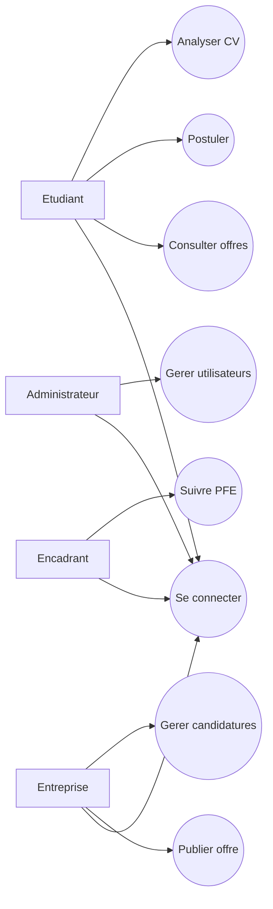

### Diagramme de classes simplifié

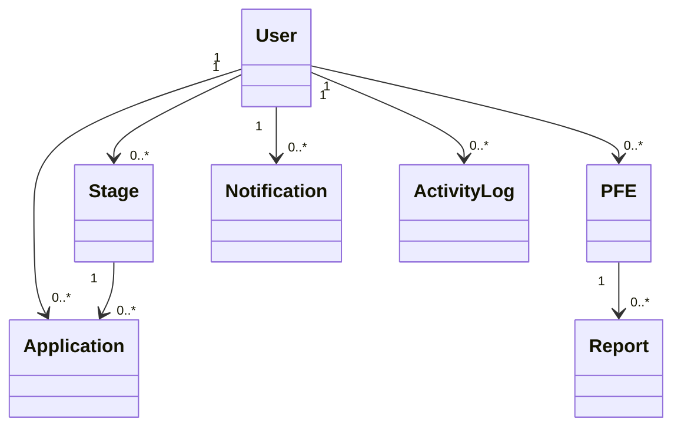

## 2.6 Modèle de données

Le modèle de données réel contient les tables suivantes :

- `users`
- `stages`
- `applications`
- `pfe`
- `reports`
- `notifications`
- `activity_logs`

Les relations principales sont :

- Une entreprise peut publier plusieurs stages.
- Un étudiant peut déposer plusieurs candidatures.
- Une offre peut recevoir plusieurs candidatures.
- Un PFE est lié à un étudiant, une entreprise et un encadrant.
- Un PFE peut contenir plusieurs rapports.
- Un utilisateur peut recevoir plusieurs notifications.

\newpage

# Chapitre 3 : Réalisation

## 3.1 Architecture Frontend

Le frontend est organisé dans le dossier `frontend/src`. La structure suit une logique modulaire afin de faciliter la maintenance.

```text
src/
├── api/
├── components/
├── hooks/
├── layouts/
├── pages/
├── routes/
├── services/
├── store/
└── utils/
```

Les pages sont regroupées par rôle : `student`, `company`, `supervisor`, `admin` et `auth`. Les composants réutilisables comme les cartes, boutons, badges de statut et notifications sont placés dans le dossier `components`.

## 3.2 Architecture Backend

Le backend est organisé autour des modules suivants :

```text
backend/app/
├── core/
├── database/
├── models/
├── routes/
├── schemas/
├── services/
├── tests/
└── utils/
```

Les routes exposent les endpoints REST, les modèles définissent les tables SQLAlchemy, les schémas Pydantic valident les données, et les services regroupent certaines logiques transversales.

## 3.3 Base de données PostgreSQL

PostgreSQL est utilisé comme système de gestion de base de données. Les migrations sont gérées avec Alembic. Deux migrations principales existent :

- `0001_initial_schema.py`
- `0002_phase4_notifications_logs.py`

## 3.4 Authentification JWT

L'authentification est basée sur les jetons JWT. Après connexion, le backend retourne un token contenant l'identifiant de l'utilisateur, son rôle et son adresse e-mail. Le frontend ajoute ce token dans les requêtes protégées grâce à un intercepteur Axios.

Les mots de passe ne sont jamais stockés en clair. Ils sont hachés avec Passlib et Bcrypt.

## 3.5 Gestion des rôles

Les rôles supportés sont :

- `student`
- `company`
- `supervisor`
- `admin`

Chaque endpoint sensible vérifie le rôle de l'utilisateur connecté. Par exemple, seul un utilisateur de type entreprise ou administrateur peut créer une offre de stage.

## 3.6 Gestion des stages

Le module stages permet de :

- Lister les offres.
- Afficher le détail d'une offre.
- Créer une offre.
- Modifier une offre.
- Supprimer une offre.

Les offres contiennent un titre, une description, des exigences, une localisation, une durée, un type et un statut.

## 3.7 Gestion des candidatures

Les étudiants peuvent postuler aux offres publiées. Une contrainte empêche un même étudiant de postuler plusieurs fois à la même offre. Les entreprises peuvent mettre à jour le statut des candidatures : acceptée, refusée ou en attente.

## 3.8 Gestion des PFE

Un PFE est associé à un étudiant, une entreprise, un encadrant et éventuellement une candidature. Le statut du projet permet de suivre son avancement : proposé, approuvé, en cours, terminé ou annulé.

## 3.9 Gestion des rapports

Les rapports sont déposés sous forme de fichiers. Le backend vérifie les extensions autorisées et la taille maximale. Les fichiers sont stockés côté serveur et référencés dans la table `reports`.

## 3.10 Notifications

Le système de notifications informe les utilisateurs lors d'événements importants : candidature acceptée ou refusée, rapport déposé, PFE validé. Une notification contient un titre, un message, un statut de lecture et une date de création.

## 3.11 Dashboards

Les dashboards fournissent une vision synthétique des données. L'administrateur visualise les statistiques globales, l'entreprise suit ses offres et candidatures, l'étudiant suit ses candidatures et son PFE, tandis que l'encadrant suit les projets affectés.

\newpage

# Chapitre 4 : Intelligence Artificielle

## 4.1 Présentation du module IA

Le module IA de STAGIO a pour objectif d'aider à l'analyse des CV et à la comparaison avec les offres de stage. Il permet de fournir un score de compatibilité entre un profil étudiant et une offre.

## 4.2 Analyse des CV

L'utilisateur peut déposer un fichier PDF. Le backend lit le contenu du fichier grâce à la bibliothèque PyPDF. Le texte extrait sert ensuite de base à l'analyse.

## 4.3 Extraction des compétences

L'extraction repose sur la détection de mots-clés techniques. Les compétences prises en compte incluent notamment : Python, SQL, Machine Learning, Docker, Kubernetes, FastAPI, React et PostgreSQL.

## 4.4 Matching CV ↔ Stage

Le système compare les compétences extraites du CV avec celles présentes dans l'offre. L'offre peut être fournie sous forme de texte ou identifiée via un `stage_id`.

## 4.5 Score de compatibilité

Le score est calculé en fonction du nombre de compétences détectées par rapport aux compétences attendues. Le résultat contient :

- Le pourcentage de compatibilité.
- Les compétences détectées.
- Les compétences manquantes.

Ce module constitue une première étape vers une solution plus avancée qui pourrait intégrer des modèles NLP plus performants.

\newpage

# Chapitre 5 : Tests et résultats

## 5.1 Tests backend

Les tests backend ont été réalisés avec Pytest. Les scénarios testés couvrent l'authentification, la création des offres et la gestion des candidatures.

Résultat obtenu :

```text
6 passed
```

## 5.2 Tests frontend

Le frontend a été validé avec la commande :

```text
npm run build
```

Le build Vite s'est terminé avec succès, confirmant que l'interface compile correctement.

## 5.3 Statistiques du projet

Les statistiques du projet sont :

- Backend : 1501 lignes Python.
- Frontend : 1439 lignes source.
- Total fichiers projet : 133.
- Total lignes texte, code et documentation : 6764.

## 5.4 Captures d'écran

### Figure 1 : Page Login STAGIO

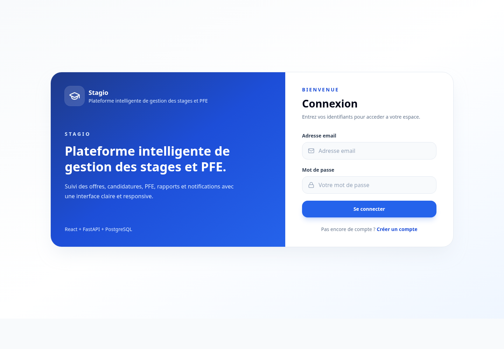

### Figure 2 : Dashboard Admin

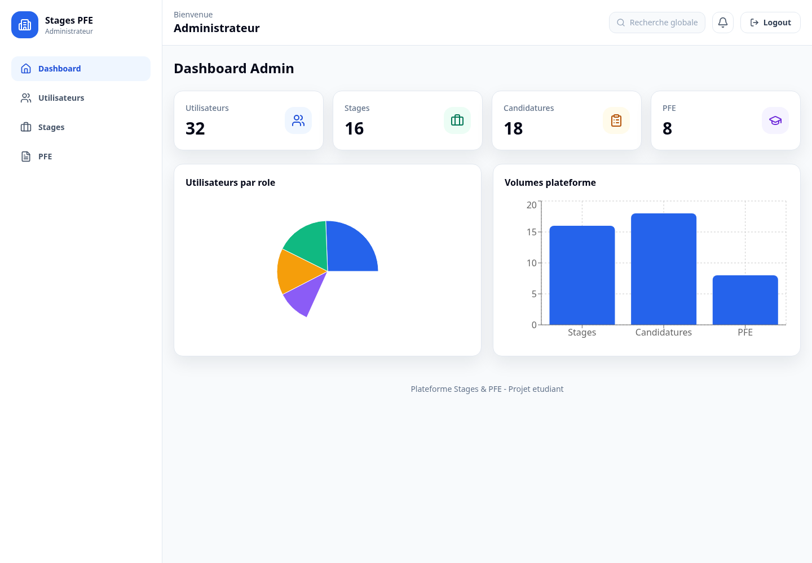

### Figure 3 : Dashboard Étudiant

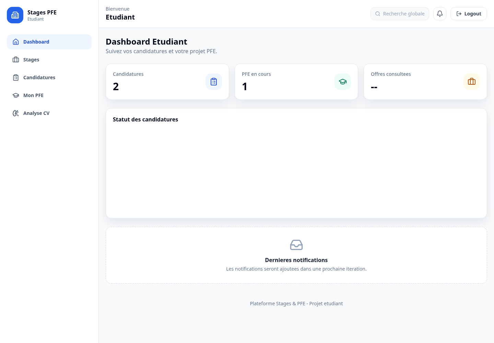

### Figure 4 : Dashboard Entreprise

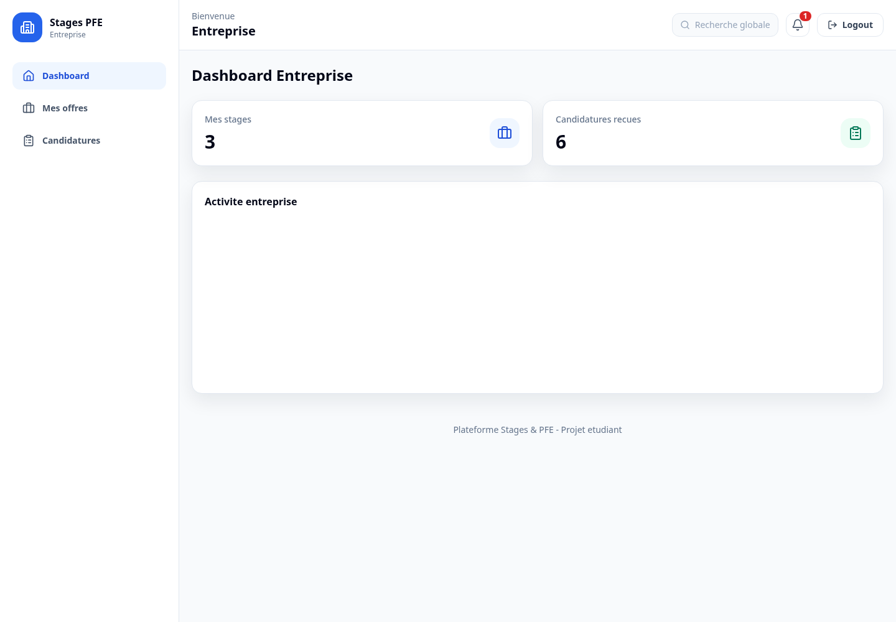

### Figure 5 : Dashboard Encadrant

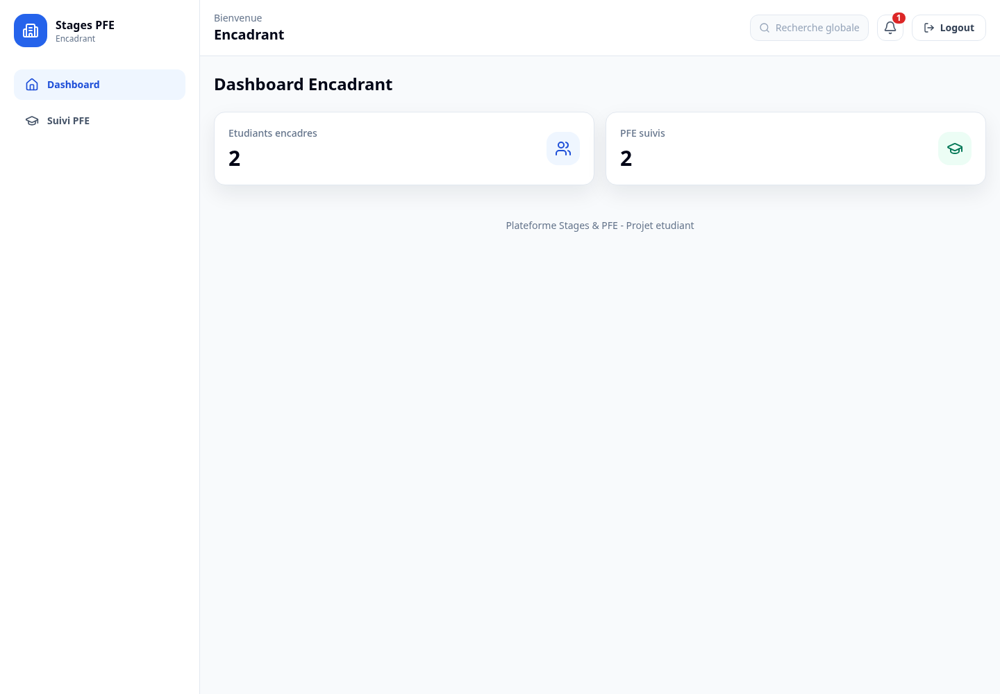

### Figure 6 : Gestion des stages

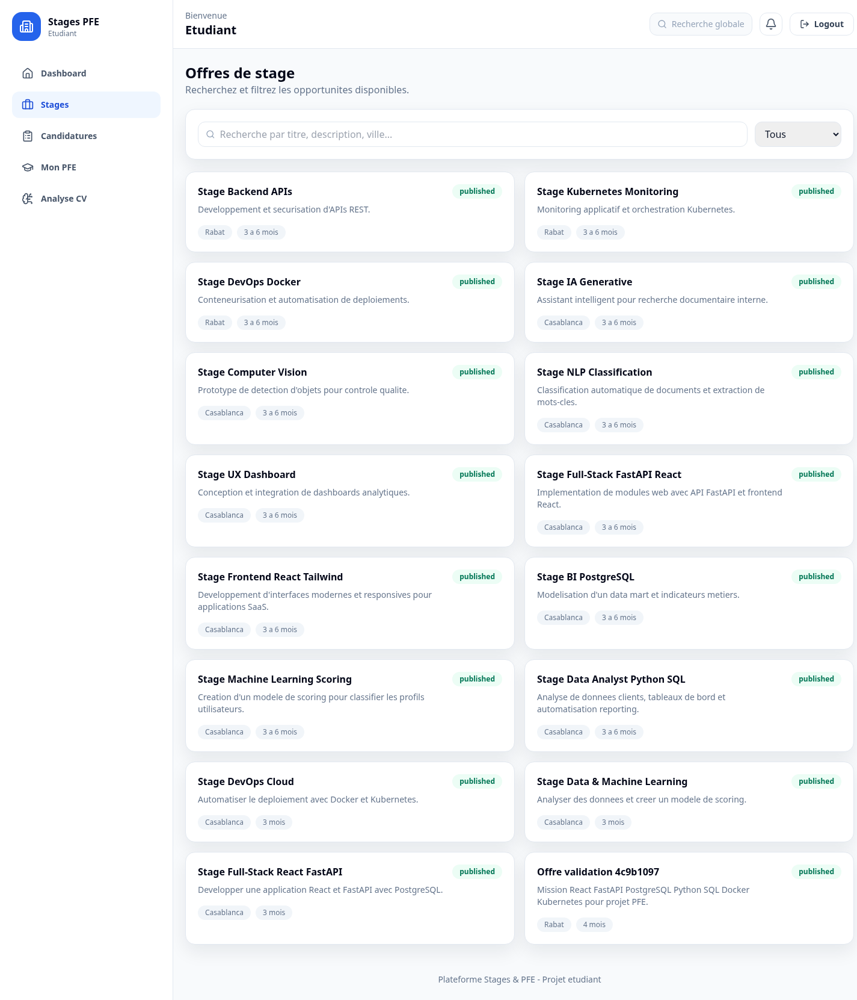

### Figure 7 : Gestion des candidatures

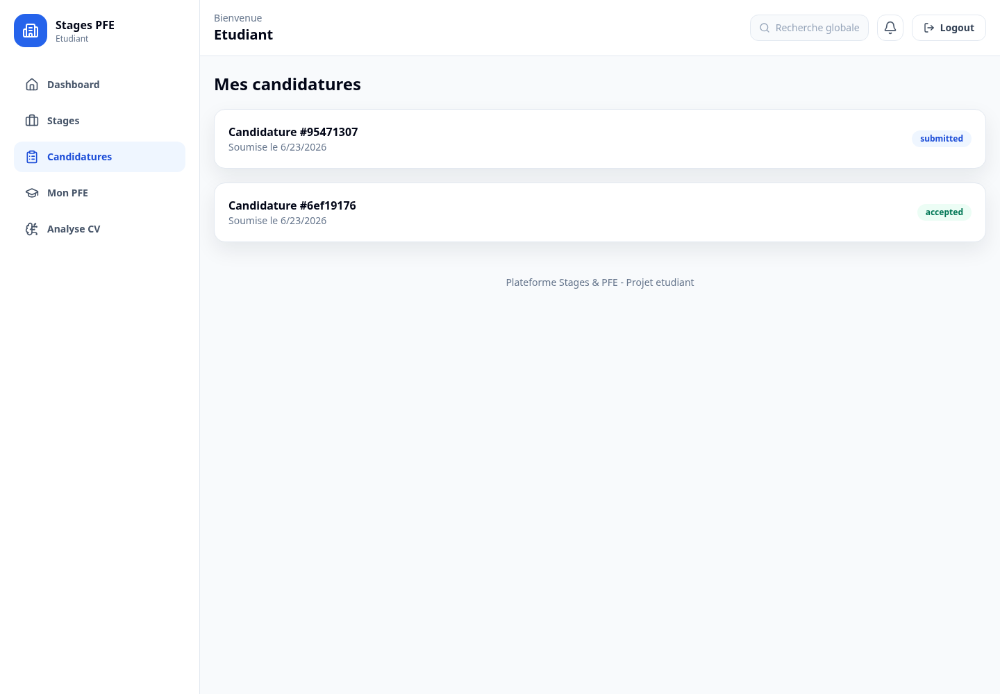

### Figure 8 : Gestion des PFE

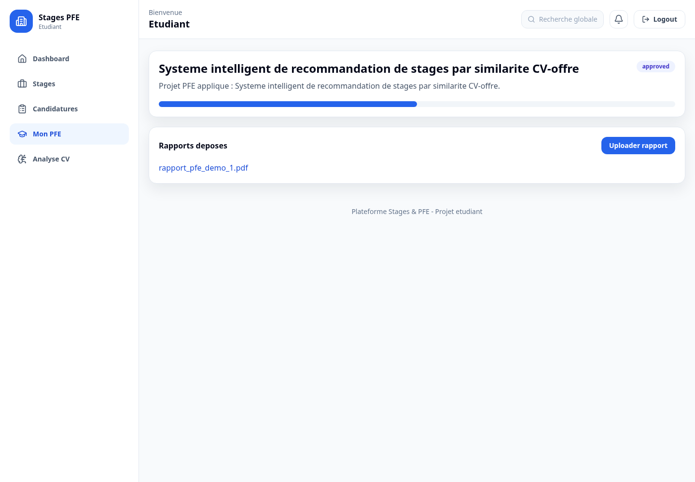

### Figure 9 : IA Matching CV

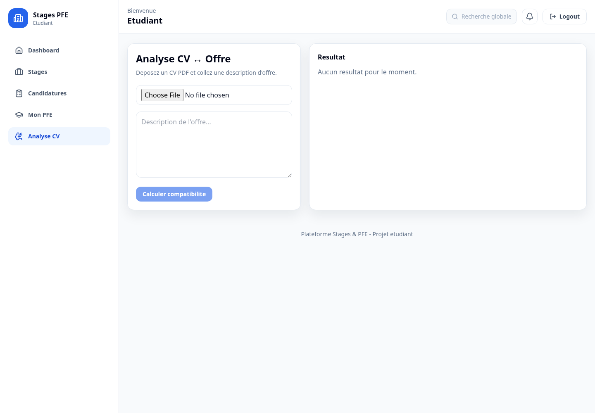

### Figure 10 : Notifications

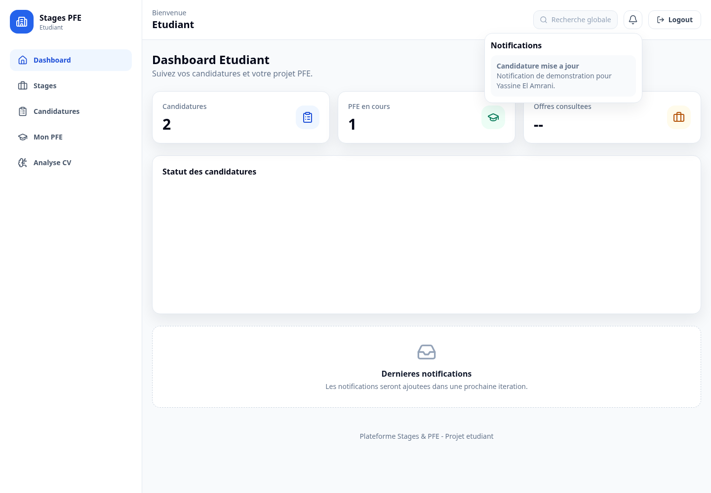

## 5.5 Résultats obtenus

La base de démonstration contient actuellement :

- 32 utilisateurs.
- 16 stages.
- 18 candidatures.
- 8 PFE.
- 20 notifications.
- 6 rapports.

Ces données permettent d'alimenter les dashboards et de présenter un environnement réaliste lors de la soutenance.

\newpage

# Chapitre 6 : Difficultés rencontrées

## 6.1 Problèmes techniques

Plusieurs difficultés ont été rencontrées pendant la réalisation du projet.

La première difficulté concernait l'organisation du projet full-stack. Il fallait séparer clairement le frontend, le backend et la base de données tout en assurant une communication fiable entre les différentes couches.

La deuxième difficulté concernait l'authentification JWT et la gestion des rôles. Il était nécessaire de sécuriser les endpoints et de s'assurer que chaque utilisateur accède uniquement aux fonctionnalités autorisées.

La troisième difficulté concernait l'upload de fichiers. Les rapports devaient être stockés de manière contrôlée, avec une vérification de l'extension et de la taille.

Une autre difficulté a été rencontrée avec Tailwind CSS. Une incompatibilité de version a provoqué un problème d'affichage. La configuration a été corrigée en stabilisant la version utilisée.

## 6.2 Solutions adoptées

Pour résoudre ces difficultés, nous avons adopté plusieurs solutions :

- Organisation modulaire du code.
- Utilisation de dépendances FastAPI pour la sécurité.
- Centralisation des appels API avec Axios.
- Utilisation d'Alembic pour les migrations.
- Mise en place de tests automatisés.
- Validation visuelle par captures d'écran.
- Documentation progressive du projet.

\newpage

# Chapitre 7 : Perspectives d'amélioration

STAGIO constitue une base fonctionnelle solide, mais plusieurs améliorations peuvent être envisagées.

## 7.1 Amélioration du module IA

Le module actuel utilise une approche basée sur les mots-clés. Une future version pourrait intégrer des modèles NLP plus avancés afin de mieux comprendre le sens des expériences et compétences mentionnées dans les CV.

## 7.2 Messagerie interne

Une messagerie entre étudiants, entreprises et encadrants pourrait améliorer la communication autour des candidatures et des PFE.

## 7.3 Suivi détaillé des PFE

Il serait possible d'ajouter des jalons, des livrables, des commentaires structurés et des évaluations périodiques.

## 7.4 Déploiement cloud

Le projet pourrait être déployé sur une infrastructure cloud avec un nom de domaine, HTTPS et une base de données managée.

## 7.5 Amélioration des statistiques

Les dashboards pourraient afficher des indicateurs plus avancés : taux d'acceptation, offres les plus demandées, compétences les plus recherchées et performance des candidatures.

\newpage

# Conclusion générale

Le projet **STAGIO** a permis de concevoir et développer une plateforme intelligente de gestion des stages et projets PFE. La solution répond à un besoin réel de centralisation, de suivi et de coordination entre les différents acteurs impliqués dans le processus des stages.

La plateforme intègre les fonctionnalités essentielles : authentification sécurisée, gestion des rôles, offres de stage, candidatures, PFE, rapports, notifications, dashboards et module IA de matching CV-offre. L'architecture choisie, basée sur React, FastAPI et PostgreSQL, offre une base moderne et évolutive.

Le travail réalisé a permis à l'équipe de renforcer ses compétences en ingénierie logicielle, développement full-stack, base de données, sécurité, tests, documentation et intelligence artificielle appliquée. STAGIO représente ainsi un projet complet, cohérent et adapté à une soutenance académique en première année TS IA.

\newpage

# Bibliographie

[1] FastAPI, "FastAPI Documentation," [En ligne]. Disponible : https://fastapi.tiangolo.com/.

[2] React, "React Documentation," [En ligne]. Disponible : https://react.dev/.

[3] PostgreSQL Global Development Group, "PostgreSQL Documentation," [En ligne]. Disponible : https://www.postgresql.org/docs/.

[4] SQLAlchemy, "SQLAlchemy Documentation," [En ligne]. Disponible : https://docs.sqlalchemy.org/.

[5] Alembic, "Alembic Documentation," [En ligne]. Disponible : https://alembic.sqlalchemy.org/.

[6] Tailwind Labs, "Tailwind CSS Documentation," [En ligne]. Disponible : https://tailwindcss.com/docs.

[7] Vite, "Vite Documentation," [En ligne]. Disponible : https://vitejs.dev/.

[8] Auth0, "Introduction to JSON Web Tokens," [En ligne]. Disponible : https://jwt.io/introduction.

[9] Mozilla Developer Network, "HTTP and Web APIs," [En ligne]. Disponible : https://developer.mozilla.org/.

[10] Python Software Foundation, "Python Documentation," [En ligne]. Disponible : https://docs.python.org/.

\newpage

# Annexes

## Annexe A : Répartition du travail

| Membre | Contribution principale |
|---|---|
| Oussama Benlaidi | Architecture, Backend FastAPI, Base de données PostgreSQL |
| Zineb Ahfid | Frontend React et interface utilisateur |
| Fanfan Erly | Documentation, tests et validation |
| Biar Malek | Recherche, conception et préparation de la soutenance |

## Annexe B : Endpoints API principaux

```text
POST /api/v1/auth/register
POST /api/v1/auth/login
GET /api/v1/users
GET /api/v1/stages
POST /api/v1/stages
GET /api/v1/applications
POST /api/v1/applications
GET /api/v1/pfe
POST /api/v1/pfe
GET /api/v1/reports
POST /api/v1/reports/{pfe_id}/upload
GET /api/v1/notifications
POST /api/v1/ai/match-cv
```

## Annexe C : GitHub Repository

Le projet est versionné sur GitHub :

```text
https://github.com/http-KAIJIN/plateforme-stages-pfe
```

## Annexe D : Confidentialité

Les comptes de démonstration ne sont pas inclus dans ce rapport afin de respecter les consignes de confidentialité.
